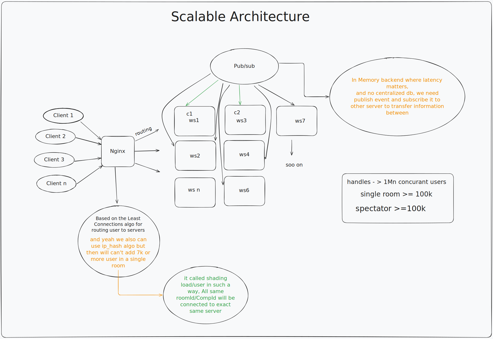

# ⌨️ TypeRace — Realtime Multiplayer Typing Race

A low-latency, scalable multiplayer typing race application. Built with raw WebSockets, no Socket.io abstraction.




---

## What I Built

- **Singleton WebSocket server** with a custom `UserManager` that tracks every connected socket in memory using a `Map<WebSocket, {compId, userId}>` — no DB, no Redis, just fast in-process state
- **Matchmaking queue** that auto-triggers a room when 2+ players join, or fires after a 10s lobby timeout — whichever comes first
- **`CompetitionManager`** as a centralized registry of all active races, routing key-press events to the correct `competition` instance by `compId`
- **Per-competition state machine** cycling through `WAITING → IN_PROGRESS → FINISHED`, with a 10-second countdown broadcast before each race
- **Real-time WPM + accuracy scoring** calculated server-side on every keystroke, using a `typos: Set<string>` keyed by `wordIdx,letterIdx` for O(1) lookup
- **`racePoints` composite score** = `(distancePercent × 0.5) + ((wpm × 0.7 + accuracy × 0.3) × 0.5)` — rewards both speed and correctness
- **1-second polling broadcast** via `setInterval` that pushes `RACE_UPDATE` snapshots of all player progress to every socket in the room
- **Dynamic paragraph fetching** from `quotable.io` API at race start, with a hardcoded fallback if the API goes down
- **Frontend WebSocket client** built as a singleton (`WebSocket_Client`) with a typed event-emitter pattern — subscribe to message types like `wsClient.on("RACE_UPDATE", cb)` instead of raw `onmessage` conditionals
- **Zustand store** managing local typing state — `typos`, `typedCharCount`, `wpm`, `accuracy` — fully decoupled from the network layer
- **TypingArea component** that validates keystrokes locally, renders per-character highlighting (correct/typo/pending), tracks cursor position with pixel-accurate CSS, and emits `KEY_PRESS` events to the backend

---


**Message Protocol**

| Direction | Type | Payload |
|-----------|------|---------|
| Server → Client | `INITIAL_AUTH` | `{ wsId }` |
| Client → Server | `join` | `{ username }` |
| Server → Client | `MATCH_MAKING` | `{ userId, matchMake }` |
| Server → Client | `INIT` | `{ myId, compId, allPlayers, paragraph, state }` |
| Server → Client | `count_down` | `{ counter, hasStarted }` |
| Server → Client | `GameInfo` | `{ paragraph, players, state }` |
| Client → Server | `KEY_PRESS` | `{ typedKey, compId, userId, wordInx, letterIdx }` |
| Server → Client | `RACE_UPDATE` | `{ players[{ userId, wpm, acc, typedCharCount, isFinished, racePoints }] }` |

---

## Tech Stack

| Layer | Tech |
|-------|------|
| Backend | Node.js, TypeScript, Express, `ws` (WebSocket) |
| Frontend | Next.js 16, React 19, TypeScript |
| State | Zustand |
| Styling | Tailwind CSS v4, shadcn/ui |
| Paragraph API | quotable.io |

---

## Running Locally

**Backend**
```bash
cd Backend
pnpm install
pnpm tsc
node dist/index.js
# Listening on :8000
```

**Frontend**
```bash
cd frontend
pnpm install
pnpm dev
# Open http://localhost:3000
```

> WebSocket connects to `ws://localhost:8000` by default. Update `wsContext.tsx` for production.

---

## Key Design Decisions

**Why raw `ws` over Socket.io?** Full control over the message protocol and no abstraction overhead — every byte sent is intentional.

**Why server-side scoring?** Prevents client-side manipulation. The server is the single source of truth for WPM, accuracy, and race position.

**Why singleton `UserManager`?** One WebSocket server, one manager instance — avoids multiple independent matchmaking queues spawning across connection events.

**Why `Set<string>` for typos?** Constant-time insert and delete on `Backspace` events, keyed by `"wordIdx,letterIdx"` — no array scanning on every keystroke.

---

## Roadmap

- [ ] Spectator mode
- [ ] Persistent leaderboard (Redis or Postgres)
- [ ] Room creation with custom paragraphs
- [ ] Reconnection handling mid-race
- [ ] Mobile-responsive typing area
